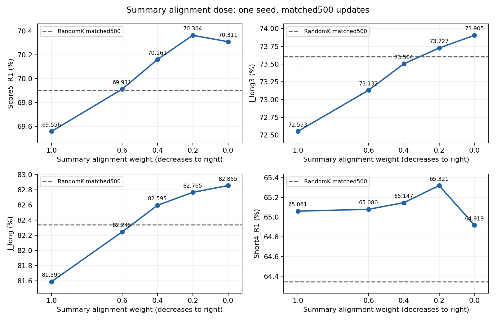

# Arm B Summary alignment-dose500 report

**LOW_DOSE_SUMMARY_OBSERVED_BEST**. E1/E2 completed fresh500, strict export, frozen native5 and read-only diagnostics.

**S=0 means zero Summary contrastive alignment weight only.** Summary is still constructed, encoded and used by original sparsity/inclusion; forward and architecture remain unchanged. The sole production edit permits zero coefficients in validation.

| S weight | F/S/D weights | Score5 | J_long3 | J_long | Short4 |
|---:|---|---:|---:|---:|---:|
| 1.0 | 1/1/1 | 69.556218 | 72.553029 | 81.590002 | 65.061000 |
| 0.6 | 1.2/0.6/1.2 | 69.911321 | 73.132202 | 82.245001 | 65.080000 |
| 0.4 | 1.3/0.4/1.3 | 70.160995 | 73.503658 | 82.595003 | 65.147000 |
| 0.2 | 1.4/0.2/1.4 | 70.364367 | 73.726611 | 82.765002 | 65.321000 |
| 0.0 | 1.5/0/1.5 | 70.310600 | 73.905001 | 82.855001 | 64.919000 |

Historical S1.0/S0.6/S0.4 are reused without retraining. E1/E2 each independently run smoke5, then fresh formal500 from identical common step0.4×256 candidates,seed0,accumulation1,horizon4868. Sampling/RNG,optimizer/LRs,auxiliary formulas/ramp and native inference are fixed.

## Main questions

1. Score5 monotonic as S decreases: **False**. J_long3 monotonic: **True**.
2. Short4 at zero versus S0.4: **-0.228000pp**; versus S0.2: **-0.402000pp**. This reports effect size without a significance claim.
3–4. Urban and Long-DCI changes are listed below for every dose and against S0.4/RandomK.
5. Actual alignment/native cosine monotonic from S0.6→S0.4→S0.2→S0.0: **False**.
6. Observed Score5 optimum: **S=0.2**; J_long3 optimum: **S=0.0**. Joint nonzero observed optimum: **False**. Single-seed500 evidence cannot establish a universal optimum.

## Five-dataset R1 and deltas

| S weight | Dataset | I2T R1 | T2I R1 | Δvs S0.4 I/T pp | Δvs RandomK I/T pp |
|---:|---|---:|---:|---|---|
| 1.0 | COCO | 60.340000 | 41.704000 | +0.020000 / -0.184000 | +0.380000 / +0.780000 |
| 1.0 | Urban-1k | 88.500005 | 86.900002 | -1.700002 / -0.700003 | -0.500000 / -1.000005 |
| 1.0 | Flickr30k-test1k | 86.700000 | 71.500000 | -0.100000 / -0.080000 | +0.500000 / +1.200000 |
| 1.0 | DOCCI | 75.280000 | 75.680000 | -0.780000 / -0.840000 | -1.040000 / -0.460000 |
| 1.0 | Long-DCI | 53.485925 | 55.472244 | -0.828729 / -0.855038 | -1.907393 / -1.394370 |
| 0.6 | COCO | 60.360000 | 41.740000 | +0.040000 / -0.148000 | +0.400000 / +0.816000 |
| 0.6 | Urban-1k | 89.700001 | 87.400001 | -0.500005 / -0.200003 | +0.699997 / -0.500005 |
| 0.6 | Flickr30k-test1k | 86.800000 | 71.420000 | +0.000000 / -0.160000 | +0.600000 / +1.120000 |
| 0.6 | DOCCI | 75.660000 | 76.220000 | -0.400000 / -0.300000 | -0.660000 / +0.080000 |
| 0.6 | Long-DCI | 53.814786 | 55.998421 | -0.499868 / -0.328861 | -1.578532 / -0.868193 |
| 0.4 | COCO | 60.320000 | 41.888000 | +0.000000 / +0.000000 | +0.360000 / +0.964000 |
| 0.4 | Urban-1k | 90.200007 | 87.600005 | +0.000000 / +0.000000 | +1.200002 / -0.300002 |
| 0.4 | Flickr30k-test1k | 86.800000 | 71.580000 | +0.000000 / +0.000000 | +0.600000 / +1.280000 |
| 0.4 | DOCCI | 76.060000 | 76.520000 | +0.000000 / +0.000000 | -0.260000 / +0.380000 |
| 0.4 | Long-DCI | 54.314654 | 56.327282 | +0.000000 / +0.000000 | -1.078664 / -0.539332 |
| 0.2 | COCO | 60.240000 | 41.844000 | -0.080000 / -0.044000 | +0.280000 / +0.920000 |
| 0.2 | Urban-1k | 90.100002 | 88.000005 | -0.100005 / +0.400001 | +1.099998 / +0.099999 |
| 0.2 | Flickr30k-test1k | 87.500000 | 71.700000 | +0.700000 / +0.120000 | +1.300000 / +1.400000 |
| 0.2 | DOCCI | 76.540000 | 76.420000 | +0.480000 / -0.100000 | +0.220000 / +0.280000 |
| 0.2 | Long-DCI | 54.709287 | 56.590371 | +0.394633 / +0.263089 | -0.684031 / -0.276243 |
| 0.0 | COCO | 60.020000 | 41.396000 | -0.300000 / -0.492000 | +0.060000 / +0.472000 |
| 0.0 | Urban-1k | 90.000004 | 87.800002 | -0.200003 / +0.199997 | +0.999999 / -0.100005 |
| 0.0 | Flickr30k-test1k | 86.500000 | 71.760000 | -0.300000 / +0.180000 | +0.300000 / +1.460000 |
| 0.0 | DOCCI | 76.600000 | 77.020000 | +0.540000 / +0.500000 | +0.280000 / +0.880000 |
| 0.0 | Long-DCI | 55.196001 | 56.813996 | +0.881347 / +0.486714 | -0.197316 / -0.052618 |

## E1/E2 full recalls

| Arm | Dataset | I2T R1/R5/R10 | T2I R1/R5/R10 |
|---|---|---|---|
| E1 | COCO | 60.240000 / 83.160000 / 89.760000 | 41.844000 / 67.428000 / 77.300000 |
| E1 | Urban-1k | 90.100002 / 98.300004 / 99.600005 | 88.000005 / 98.400003 / 99.400002 |
| E1 | Flickr30k-test1k | 87.500000 / 97.600000 / 99.300000 | 71.700000 / 91.420000 / 95.500000 |
| E1 | DOCCI | 76.540000 / 94.980000 / 97.600000 | 76.420000 / 94.980000 / 97.620000 |
| E1 | Long-DCI | 54.709287 / 74.559326 / 80.807682 | 56.590371 / 76.111550 / 81.873191 |
| E2 | COCO | 60.020000 / 82.600000 / 89.200000 | 41.396000 / 67.152000 / 76.840000 |
| E2 | Urban-1k | 90.000004 / 98.200005 / 99.500006 | 87.800002 / 98.300004 / 99.500006 |
| E2 | Flickr30k-test1k | 86.500000 / 97.400000 / 99.300000 | 71.760000 / 91.440000 / 95.380000 |
| E2 | DOCCI | 76.600000 / 95.240000 / 97.660000 | 77.020000 / 94.940000 / 97.600000 |
| E2 | Long-DCI | 55.196001 / 74.888187 / 80.794528 | 56.813996 / 76.322021 / 81.952118 |

## Actual last50 CE and frozen-checkpoint last50 gradient shares

CE below is the actual update451..500 mean. Gradient shares are **read-only replay of those50 input batches at checkpoint500**, rather than per-update historical gradients. Relative shares omit the common10/3; they are not exact summed-gradient or optimizer displacement contribution percentages.

| Arm | View | Last50 raw CE | Weighted CE | Weighted CE share | Last50 replay raw gradient norm | Weighted gradient norm share |
|---|---|---:|---:|---:|---:|---:|
| E1 | F | 0.115789 | 0.162105 | 8.684% | 8.149625 | 23.357% |
| E1 | S | 1.844004 | 0.368801 | 19.757% | 29.700696 | 12.282% |
| E1 | D | 0.954117 | 1.335764 | 71.559% | 22.376283 | 64.361% |
| E2 | F | 0.120707 | 0.181061 | 11.182% | 8.278172 | 26.921% |
| E2 | S | 17.163768 | 0.000000 | 0.000% | 531.576165 | 0.000% |
| E2 | D | 0.958794 | 1.438191 | 88.818% | 22.477151 | 73.079% |

## Fixed8 actual alignment/native cosine

Every dose below uses the same first8 real4-card global batches. Historical S0.6/S0.4 diagnostics are reused; no reference training or full32-batch audit is rerun. Comparisons across checkpoints mix learned-state and coefficient effects. S1.0 native-gradient cosine was not previously audited and is not invented.

| S weight | Vision backbone | Text backbone | Native backbone total |
|---:|---:|---:|---:|
| 0.6 | 0.528846 | 0.364349 | 0.467383 |
| 0.4 | 0.574895 | 0.415255 | 0.517283 |
| 0.2 | 0.576716 | 0.422259 | 0.519495 |
| 0.0 | 0.578228 | 0.398908 | 0.511981 |

## Resources

| Arm | Normal full-cycle mean seconds | Peak allocated GiB |
|---|---:|---:|
| E1 | 2.091141 | 27.759893 |
| E2 | 2.091014 | 27.759893 |

## Correctness and stopping

26 initial tests pass, including zero Summary alignment gradients with nonzero Summary sparsity gradients. Both preflights prove1000-sample equality and live500×4 stream matches to S0.4. Default forward/optimizer/scheduler/sampler/evaluator sources remain unchanged; the hparams change only permits nonnegative coefficients and rejects an all-zero total. Each formal run starts at step0 with empty optimizer and resume=None.

Five native evaluators use strict exported bare students only. Long-DCI remains7602/7602,manifestSHA8890a2be15e2b64c142f9a1e39224d34b6ce92fc17ffb6099e14942cc8161c4b. Training masks/local views do not enter native inference.

Observed S0.2 wins Score5 and S0.0 drops; supports a low but nonzero Summary CE dose in this500-step seed. Check the separate J_long3 optimum before full confirmation.

For an overall/short-text confirmation, S0.2 is the current observed candidate. For a long-text-first objective, S0.0 is the observed candidate. Their Score5 difference is only0.053766pp and the optima differ, so this run does not establish a clearly unique Summary dose. A4868 confirmation is a recommendation only; no full run was launched.

This normalized dose path lowers S while increasing both F and D. Therefore the complete effect cannot be attributed solely to removing Summary CE; separate F/D reweighting would be a future experiment, not part of this task.

No other weights, no new training beyond E1/E2×500, no4868 run. Full gradients, datasets and checkpoints remain outside Git. Branch:codex/nest-balanced-armb-summary-dose-500-v1.
